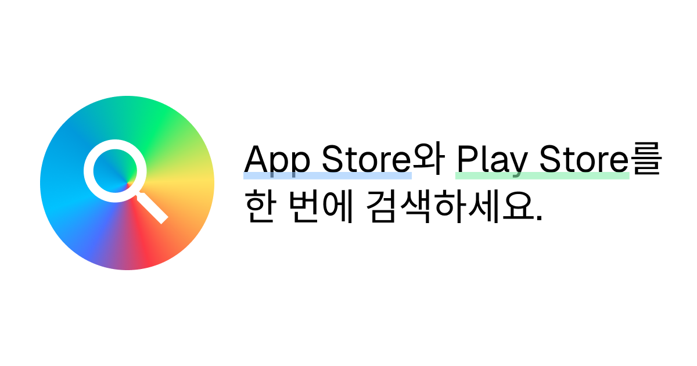

# 🔍 Omnisearch

**App Store와 Play Store를 한 번에 검색하세요**

[Live Demo](https://omnisearch.store) · [Report Bug](https://github.com/w00ye0l/omnisearch/issues) · [Request Feature](https://github.com/w00ye0l/omnisearch/issues)

---

## 주요 기능

- **통합 검색** - App Store와 Play Store를 동시에 검색
- **다국가 지원** - 30개 이상의 국가별 앱 검색
- **상세 정보** - 앱 평점, 가격, 스크린샷, 설명 제공
- **인기 앱** - 무료/유료 인기 앱 랭킹 제공
- **반응형 디자인** - 모바일, 태블릿, 데스크톱 최적화
- **Analytics** - Google Analytics 및 Vercel Analytics 통합

## 기술 스택

### Core

- **Framework**: [Next.js 15](https://nextjs.org) - React 프레임워크
- **Language**: [TypeScript](https://www.typescriptlang.org) - 타입 안정성
- **Styling**: [Tailwind CSS](https://tailwindcss.com) - 유틸리티 우선 CSS

### Libraries

- **UI Components**: [Shadcn UI](https://ui.shadcn.com) - 재사용 가능한 컴포넌트
- **Icons**: [Lucide React](https://lucide.dev) - 아이콘 라이브러리
- **Store Scraping**: [google-play-scraper](https://github.com/facundoolano/google-play-scraper), [app-store-scraper](https://github.com/facundoolano/app-store-scraper)

## 지원 국가

30개 이상의 국가를 지원합니다:

- 🇰🇷 한국, 🇺🇸 미국, 🇯🇵 일본, 🇨🇳 중국, 🇬🇧 영국
- 🇩🇪 독일, 🇫🇷 프랑스, 🇪🇸 스페인, 🇮🇹 이탈리아
- 🇧🇷 브라질, 🇲🇽 멕시코, 🇨🇦 캐나다, 🇦🇺 호주
- 그 외 다수...

## 라이선스

이 프로젝트는 [MIT](LICENSE) 라이선스 하에 배포됩니다.

## 개발자

**wooyeol**

- GitHub: [@w00ye0l](https://github.com/w00ye0l)

## 감사의 말

이 프로젝트는 다음 오픈소스 프로젝트들을 사용합니다:

- [EasyNext](https://github.com/easynext/easynext) - Next.js 프로젝트 생성 도구
- [google-play-scraper](https://github.com/facundoolano/google-play-scraper)
- [app-store-scraper](https://github.com/facundoolano/app-store-scraper)
- [Shadcn UI](https://ui.shadcn.com)

---

Made with by [w00ye0l](https://github.com/w00ye0l)

[⬆ Back to Top](#-omnisearch)

